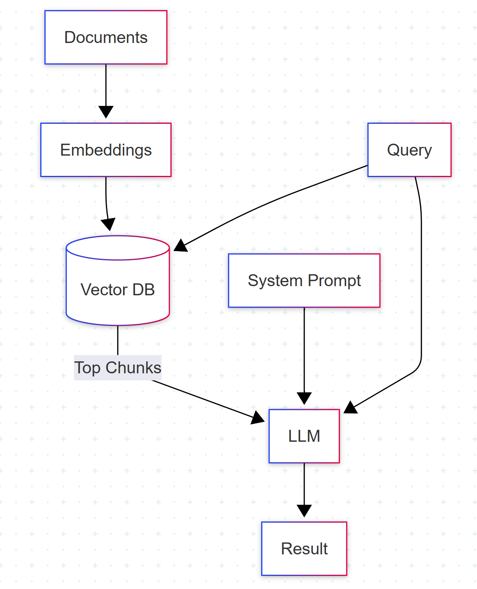

# GraphRAG:  
Advancing Retrieval-Augmented Generation

*Unlocking deeper knowledge with graphs*

---

## Baseline RAG

---

## Shortcomings of Baseline RAG

- **Shallow Retrieval**: Only surfaces top text "chunks"; misses deeper connections
- **Limited Context**: Context sometimes fragmented or incomplete
- **No Relationship Awareness**: Can't connect data points not in the same chunk
- **Hallucination**: LLM might fabricate links or answers when info is spread across documents

---

## The Need for Deeper Retrieval

- Many questions require **integrating** facts or concepts scattered across sources
- Classic RAG retrieves isolated passages, not the relationships **between** them

---

## Introducing GraphRAG

**GraphRAG** = Graph-based Retrieval-Augmented Generation

- Enhances classic RAG by incorporating a structured knowledge graph
    - Nodes: Entities, concepts, or document chunks
    - Edges: Semantic relationships (e.g., "cites", "explains", "relates to")
- Integrates retrieval and generation with graph-structured information

---

## How Does GraphRAG Work?

1. **Build Knowledge Graph** from your corpus (documents, entities, relationships)
2. **Query** traverses the graph to identify relevant nodes AND their relationships
3. **Retrieval** gathers richer, connected context (not just top chunks)
4. **LLM Generation** now draws on both text and graph structure

---

## Benefits of GraphRAG

- **Richer Context**: Surfaces connected facts across documents
- **Relationship Awareness**: Reveals how concepts are linked
- **Reduced Hallucination**: LLM gets explicit relations, not just text blobs
- **Better Answers**: Especially for multi-hop, complex, or synthesis questions

---

## Example: GraphRAG vs Baseline RAG

**Baseline RAG:**
> *Finds three paragraphs about A and B separately — misses the fact they're related*

**GraphRAG:**
> *Finds A and B, plus an edge showing "A leads to B", improving the answer's accuracy*

---

<!--
style: "img { width: 400px; max-width: 100%; height: auto; display: block; margin: auto; }"
-->

## Tech Radar: Trial

#### My Rating: Trial

