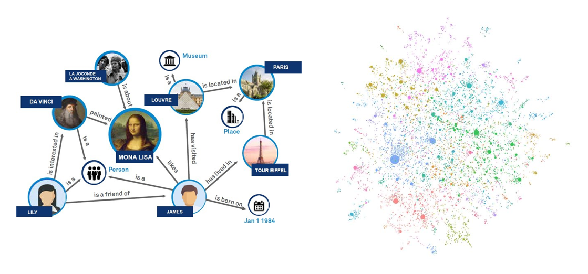
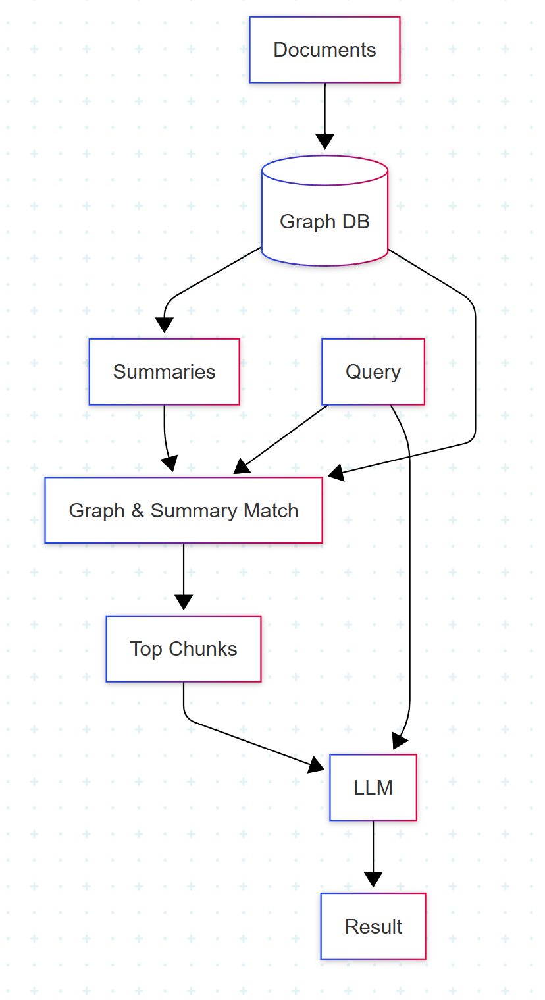
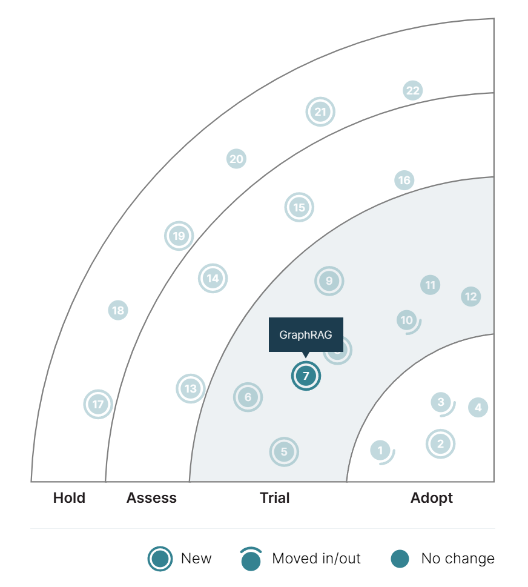

# GraphRAG:  
Advancing Retrieval-Augmented Generation

*Unlocking deeper knowledge with graphs*

---

## Baseline RAG

---

## Shortcomings of Baseline RAG

- "Connect the Dots"
- Holistic Understanding

---

## Knowledge Graph

 

<a href="https://convergetp.com/2024/08/07/graphrag-elevating-rag-with-next-gen-knowledge-graphs/">Source 1</a>
<a href="https://www.microsoft.com/en-us/research/blog/graphrag-unlocking-llm-discovery-on-narrative-private-data/">Source 2</a>

---

## GraphRAG

---

## Benefits

- Improved answers for:
  - Broad questions
  - Vague questions
  - Questions needing context
- Better explainability

---

## Drawbacks

- Speed
- Cost of data preparation
- Difficulty of graph generation

---

## Tech Radar: Trial

#### My Rating: Trial

